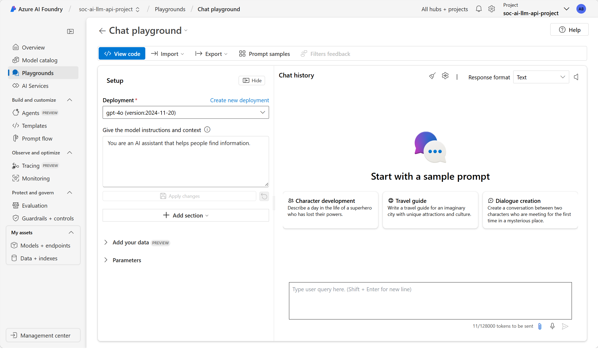

# Sentinel Foundry AI Workflows

Azure Logic App ARM templates that embed AI-assisted capabilities directly into Microsoft Sentinel workflows using a private Azure AI Foundry LLM endpoint.

This is a working demonstration of a core idea: **one model deployment can serve many different SOC use cases because the logic lives in the API call itself, not in the model.** Each workflow sends a structured request with a system prompt that defines the task - summarize an incident, generate KQL, assess severity, research entities, evaluate PIM activity. The model stays the same. The behavior changes based on how the request is constructed.

This pattern works for teams without Microsoft Security Copilot access and as an added capability for teams that have it. It is practical for budget-constrained environments, government clouds, and any team that wants to integrate AI into existing SOC workflows without building a chatbot or adopting a new platform.

The templates were originally built and tested in Azure Government to validate the pattern for federal teams. With endpoint and connection adjustments at deploy time, they work equally well in Azure commercial.

This repository is part of a series. The first article, [Building a SOC AI API with Azure AI Foundry](https://www.techchat.blog/2026/03/28/building-a-soc-ai-api-with-azure-ai-foundry/), covers setting up the Foundry hub, project, and model deployment that these workflows depend on. A follow-up article covering the Logic App workflows in this repo will be published soon.

## Screenshots


## Workflows

| Workflow | Purpose | Screenshot | Deploy |
| --- | --- | --- | --- |
| [close_low_risk_fp_using_foundry_ai](./close_low_risk_fp_using_foundry_ai/README.md) | Compare incident against historical closure patterns and close if it matches a likely false positive | [image](./images/close_low_risk_fp_using_foundry_ai.png) | [deploy](./close_low_risk_fp_using_foundry_ai/README.md#deploy-to-azure) |
| [entity_research_using_foundry_ai](./entity_research_using_foundry_ai/README.md) | Retrieve and enrich incident entities; more powerful when combined with external grounding | [image](./images/entity_research_using_foundry_ai.png) | [deploy](./entity_research_using_foundry_ai/README.md#deploy-to-azure) |
| [get_incident_tasks_from_foundry_ai](./get_incident_tasks_from_foundry_ai/README.md) | Generate up to ten investigation or response tasks and create them on the incident | [image](./images/get_incident_tasks_from_foundry_ai.png) | [deploy](./get_incident_tasks_from_foundry_ai/README.md#deploy-to-azure) |
| [get_kql_from_foundry_ai](./get_kql_from_foundry_ai/README.md) | Accept a natural language question via webhook and return a generated KQL query | [image](./images/get_kql_from_foundry_ai.png) | [deploy](./get_kql_from_foundry_ai/README.md#deploy-to-azure) |
| [get_recovery_steps_from_foundry_ai](./get_recovery_steps_from_foundry_ai/README.md) | Accept a question via webhook and return structured recovery or response steps | [image](./images/get_recovery_steps_from_foundry_ai.png) | [deploy](./get_recovery_steps_from_foundry_ai/README.md#deploy-to-azure) |
| [prioritize_incident_using_foundry_ai](./prioritize_incident_using_foundry_ai/README.md) | Evaluate severity against historical trends, recommend a change, and update the incident | [image](./images/prioritize_incident_using_foundry_ai.png) | [deploy](./prioritize_incident_using_foundry_ai/README.md#deploy-to-azure) |
| [send_foundry_ai_generated_email_summary](./send_foundry_ai_generated_email_summary/README.md) | Produce an HTML incident summary for email or Teams; requires a messaging connector in production | [image](./images/send_incident_to_foundry_ai.png) | [deploy](./send_foundry_ai_generated_email_summary/README.md#deploy-to-azure) |
| [send_incident_to_foundry_ai](./send_incident_to_foundry_ai/README.md) | Send incident title, severity, and alerts to the model and add the summary to incident comments | [image](./images/send_incident_to_foundry_ai.png) | [deploy](./send_incident_to_foundry_ai/README.md#deploy-to-azure) |
| [use_foundry_ai_to_evaluate_pim](./use_foundry_ai_to_evaluate_pim/README.md) | Query Entra ID PIM history daily and generate an HTML summary of unusual patterns | [image](./images/use_foundry_ai_to_evaluate_pim.png) | [deploy](./use_foundry_ai_to_evaluate_pim/README.md#deploy-to-azure) |

## Prerequisites

- Azure subscription (commercial or government) with permission to deploy `Microsoft.Logic/workflows`
- Existing `Microsoft.Web/connections` resources for Sentinel and Azure Monitor Logs where required by the template
- An Azure AI Foundry project and deployed model (see setup steps below)
- Managed identity permissions for the deployed Logic App (see permission table below)

## Setting Up Azure AI Foundry

These workflows call a private Foundry API endpoint using Managed Identity. The [Building a SOC AI API with Azure AI Foundry](https://www.techchat.blog/2026/03/28/building-a-soc-ai-api-with-azure-ai-foundry/) article covers this setup in full detail. The steps below are a quick reference.



If you do not already have a Foundry hub and project, follow these steps.

### 1. Create a Resource Group

Create a dedicated resource group for the Foundry environment. This keeps everything isolated and simplifies cleanup.

### 2. Create an Azure AI Foundry Hub

Search for **Azure AI Foundry** in the Azure portal and create a new hub.

- Select identity-based storage access and disable shared key access
- Leave inbound access as public initially
- The hub automatically provisions a storage account and Key Vault

### 3. Create a Project

Launch Foundry and create a new project within the hub. The project is your API boundary - the endpoint your Logic Apps will call.

One project typically covers all use cases because behavior is defined by the system prompt in each API request. Create additional projects only when you need separation for security, data, or deployment lifecycle reasons.

### 4. Deploy a Model

Select a model such as GPT-4o using **Microsoft-hosted** deployment with the **Data zone (Standard)** option to keep data within a geographic boundary. You can swap models later without rebuilding the project.

### 5. Note the API Endpoint

After deployment, copy the endpoint URI. The hub creates a Key Vault that can store the API key, but Managed Identity is the preferred authentication method from Azure services and avoids key management entirely.

### 6. Assign Permissions

The Logic App Managed Identity requires the following role assignments before workflows will run successfully:

| Role | Scope |
| --- | --- |
| Microsoft Sentinel Responder | Sentinel workspace |
| Cognitive Services User | Foundry resource |
| Microsoft Sentinel Playbook Operator | Sentinel workspace (optional, for manual testing) |

## Deployment

Each workflow folder includes Deploy to Azure buttons in the same style used by Microsoft Sentinel playbook READMEs.

If you prefer CLI or PowerShell instead of the portal button, use the helper scripts in the repo root.

PowerShell:

```powershell
.\deploy.ps1 -WorkflowFolder close_low_risk_fp_using_foundry_ai -ResourceGroup <resource-group>
```

Bash:

```bash
./deploy.sh close_low_risk_fp_using_foundry_ai <resource-group>
```

Override template parameters at deployment time when your environment differs from the embedded defaults.

PowerShell example:

```powershell
.\deploy.ps1 \
  -WorkflowFolder close_low_risk_fp_using_foundry_ai \
  -ResourceGroup <resource-group> \
  -Parameters @(
    "workflows_close_low_risk_fp_using_foundry_ai_name=my-workflow-name",
    "connections_azuresentinel_4_externalid=/subscriptions/<sub>/resourceGroups/<rg>/providers/Microsoft.Web/connections/azuresentinel-4",
    "connections_azuremonitorlogs_1_externalid=/subscriptions/<sub>/resourceGroups/<rg>/providers/Microsoft.Web/connections/azuremonitorlogs-1"
  )
```

## Notes

- The embedded template defaults reference Azure Government endpoints and connection resource IDs - override these at deploy time for commercial Azure
- Some workflows still need runtime hardening before production use