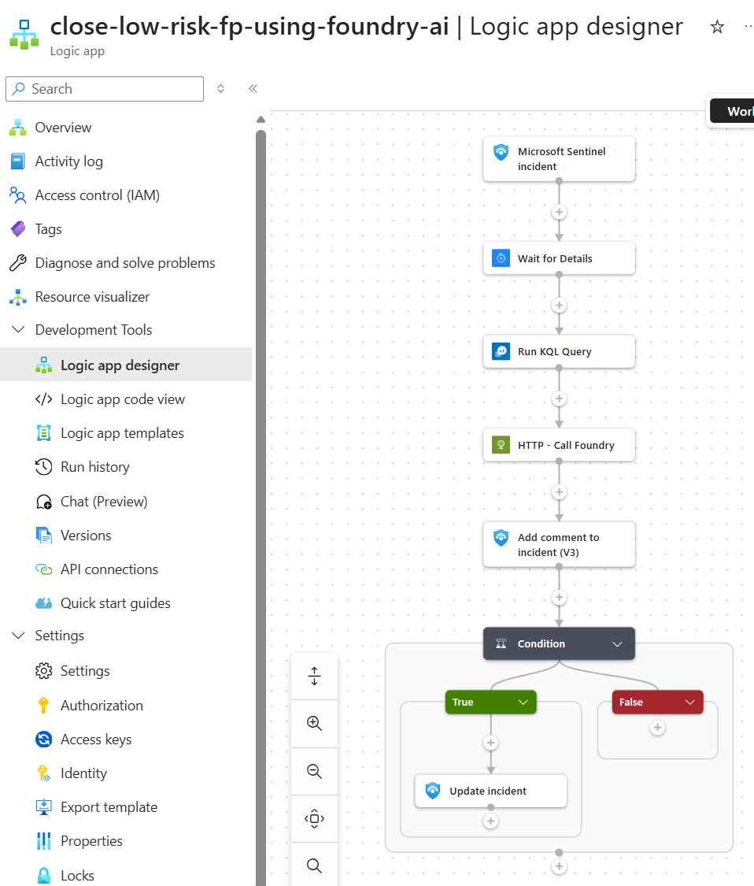

# Close Low-Risk False Positives Using Foundry AI

Compares a Sentinel incident against historical closure patterns and recommends whether to close it as a likely false positive. If the threshold is met, it closes the incident and documents the reasoning. Over time, this begins to reflect how analysts have historically handled similar cases.

## Prerequisites

- Existing Azure Sentinel API connection
- Existing Azure Monitor Logs API connection
- Azure OpenAI or Foundry endpoint configured in the template
- Managed identity permissions for the deployed Logic App to call the model endpoint

## Screenshot

## Deploy to Azure

## Notes

- This workflow is part of an API-first SOC pattern where Logic Apps orchestrate inputs and a shared private Foundry endpoint performs the AI task
- Override connection resource IDs during deployment if they differ from the exported defaults
- This workflow uses both Sentinel incident data and Azure Monitor history
