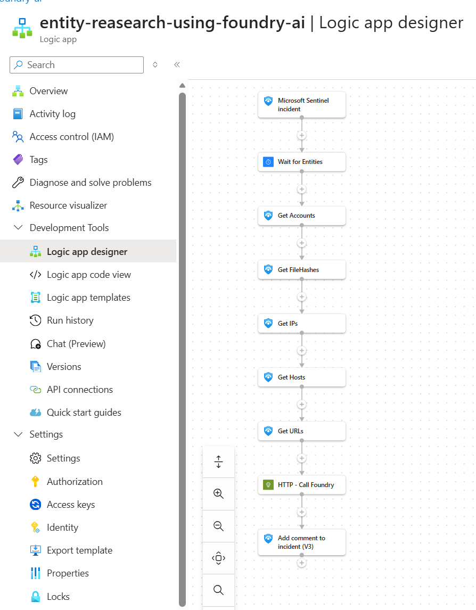

# Entity Research Using Foundry AI

Retrieves entities from a Sentinel incident and enriches them using the model. A short delay is included to ensure entities are available before the workflow runs. This becomes significantly more powerful when combined with external grounding such as threat intelligence or Azure AI Search.

## Prerequisites

- Existing Azure Sentinel API connections for trigger, entity extraction, and comment actions
- Azure OpenAI or Foundry endpoint configured in the template
- Managed identity permissions for the deployed Logic App to call the model endpoint

## Screenshot

## Deploy to Azure

## Notes

- This workflow is part of an API-first SOC pattern where Logic Apps orchestrate inputs and a shared private Foundry endpoint performs the AI task
- This workflow preserves the original exported folder naming
- Update connection resource IDs if your Sentinel connection names differ from the template defaults

