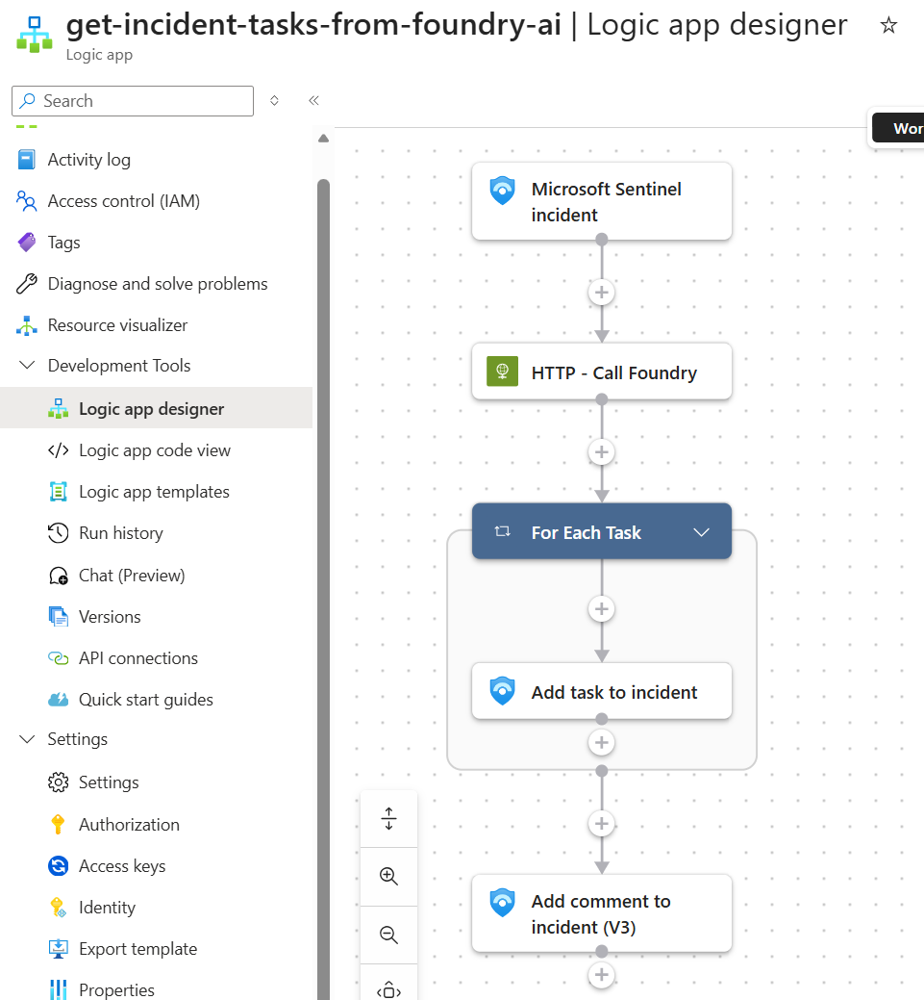

# Generate Incident Tasks Using Foundry AI

Generates up to ten investigation or response tasks based on incident details, then loops through the results to create each task directly on the Sentinel incident and adds supporting context.

## Prerequisites

- Existing Azure Sentinel API connection
- Azure OpenAI or Foundry endpoint configured in the template
- Managed identity permissions for the deployed Logic App to call the model endpoint

## Screenshot

## Deploy to Azure

## Notes

- This workflow is part of an API-first SOC pattern where Logic Apps orchestrate inputs and a shared private Foundry endpoint performs the AI task
- Override template parameters during deployment if your connection resource IDs or naming differ from the defaults
