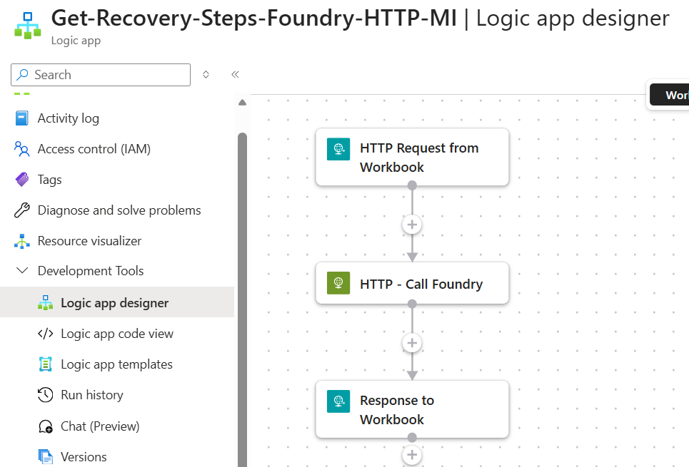

# Generate Recovery Steps Using Foundry AI

Accepts a question via webhook, typically triggered from a Sentinel workbook, and returns structured recovery or response steps using Managed Identity for authentication. Grounding on internal SOPs or runbooks can be added through the system prompt.

## Prerequisites

- Azure OpenAI or Foundry endpoint configured in the template
- Managed identity permissions for the deployed Logic App to call the model endpoint

## Screenshot

## Deploy to Azure

## Notes

- This workflow is part of an API-first SOC pattern where Logic Apps orchestrate inputs and a shared private Foundry endpoint performs the AI task
- After deployment, copy the generated HTTP callback URL into the workbook or caller that will invoke the workflow

