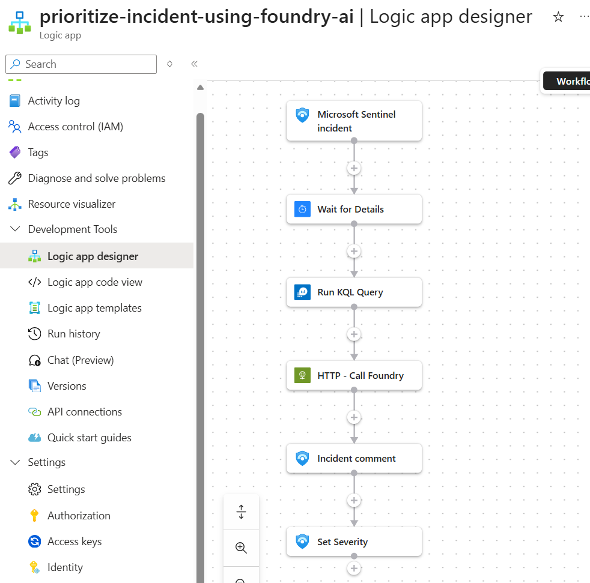

# Prioritize Incidents Using Foundry AI

Evaluates incident severity based on current incident details and historical trends. Recommends whether severity should change, documents the reasoning in the incident, and updates the severity field when the recommendation meets a threshold.

## Prerequisites

- Existing Azure Sentinel API connection
- Existing Azure Monitor Logs API connection
- Azure OpenAI or Foundry endpoint configured in the template
- Managed identity permissions for the deployed Logic App to call the model endpoint

## Screenshot

## Deploy to Azure

## Notes

- This workflow is part of an API-first SOC pattern where Logic Apps orchestrate inputs and a shared private Foundry endpoint performs the AI task
- This workflow depends on both Sentinel and Azure Monitor Logs connections
