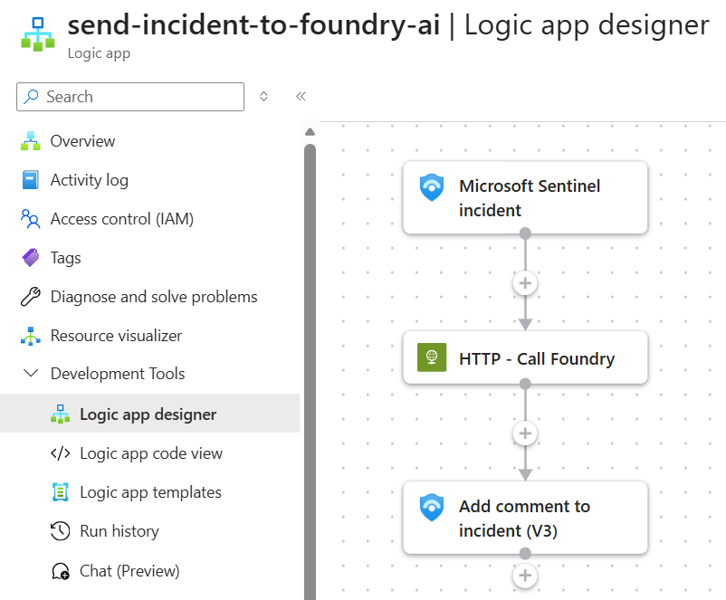

# Send Incident Context Using Foundry AI

Sends core incident context to the model and writes recommended incident response guidance back to the Sentinel incident as a comment.

## Prerequisites

- Existing Azure Sentinel API connection
- Azure OpenAI or Foundry endpoint configured in the template
- Managed identity permissions for the deployed Logic App to call the model endpoint

## Screenshot

## Deploy to Azure

## Notes

- This workflow is part of an API-first SOC pattern where Logic Apps orchestrate inputs and a shared private Foundry endpoint performs the AI task
- Override template parameters during deployment if your Sentinel connection resource ID differs from the default
