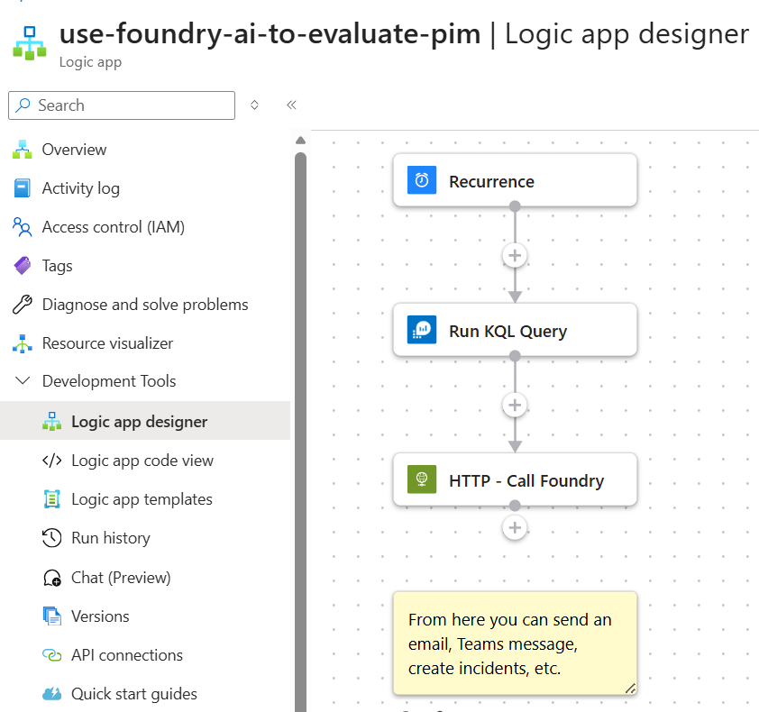

# Evaluate PIM Activity Using Foundry AI

Runs on a daily schedule, queries Entra ID PIM request history from Azure Monitor Logs, compares recent activity against historical patterns, and generates an HTML summary highlighting unusual or notable activity.

## Prerequisites

- Existing Azure Monitor Logs API connection
- Azure OpenAI or Foundry endpoint configured in the template
- Managed identity permissions for the deployed Logic App to call the model endpoint

## Screenshot

## Deploy to Azure

## Notes

- This workflow is part of an API-first SOC pattern where Logic Apps orchestrate inputs and a shared private Foundry endpoint performs the AI task
- This workflow runs on a recurrence trigger rather than Sentinel incident creation
